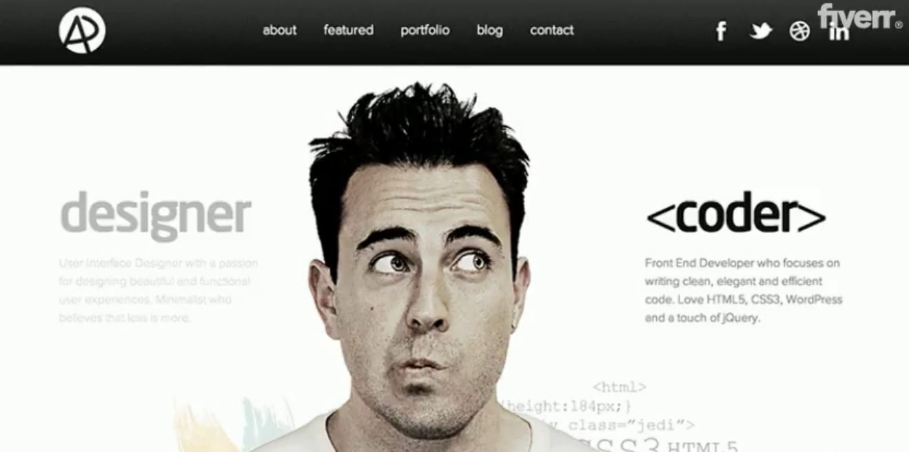
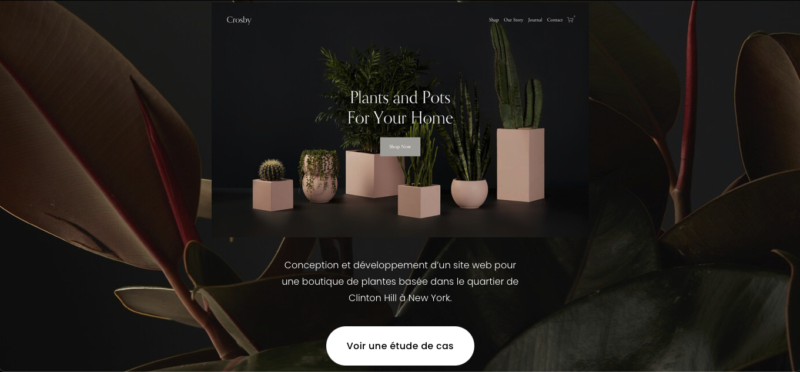
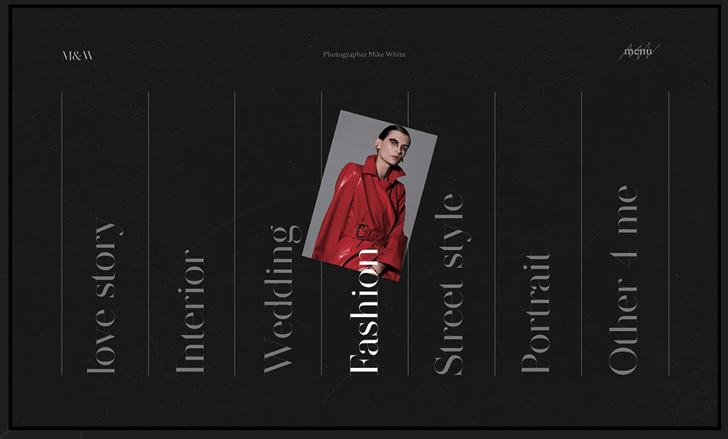
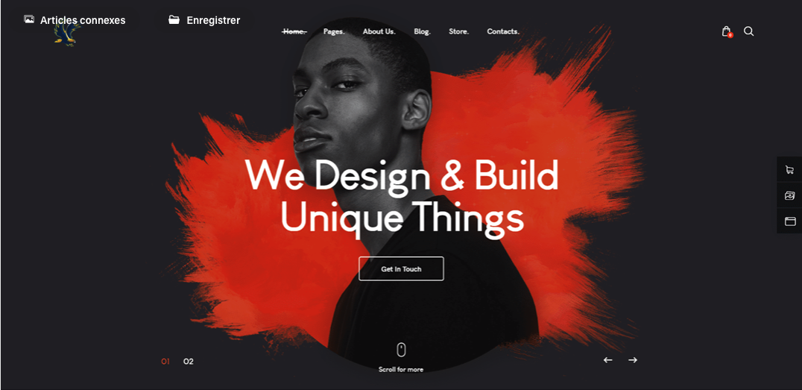
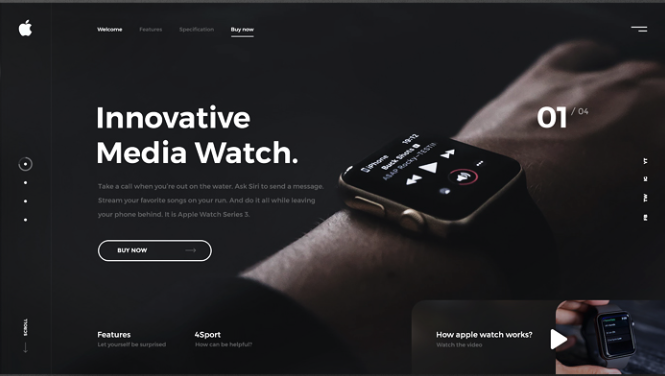
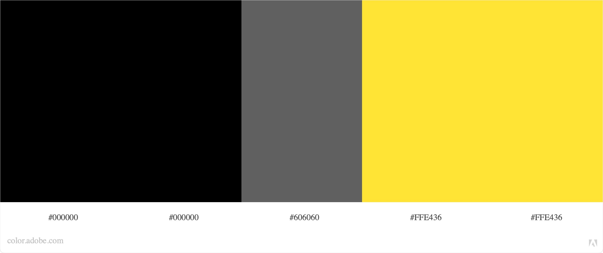
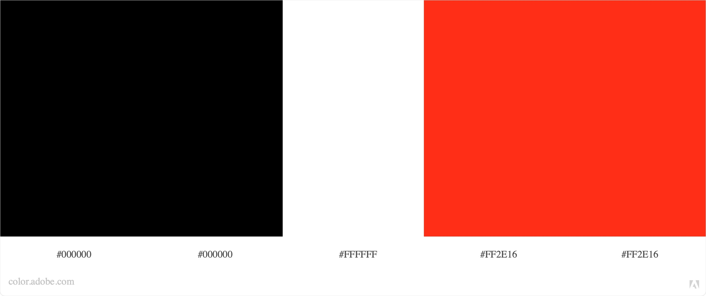

# Moodboard

## Mood général 

## Menu

[Séparation des sous-catégories](https://www.behance.net/gallery/111465583/Photographer-Mike-White?tracking_source=search_projects_recommended%7Cportfolio%20website)

[Menu au dessus de la page, barré la section actuel](https://www.behance.net/gallery/106729969/Clean-Portfolio-Website-Design?tracking_source=search_projects_recommended%7Cportfolio%20website)

[Compartimentation de la page](https://pin.it/7h8OBzz)

[Aller de comptétences en compétences](https://pin.it/4xJNvkV)

[Les parties sont représentées par des points qui sont encerclé quand on est la partie](https://dribbble.com/shots/4730541)

[Pour une ligne du temps ou un historique ou un ordre chronologique](https://www.behance.net/gallery/43818043/Personal-website)

## Couleurs

Palette de 2,3 couleurs

[Jeu entre noir et gris, peut-être ajouter du rouge pour les éléments important](https://www.behance.net/gallery/108115427/Website-Portfolio-Design-UXUI?tracking_source=search_projects_recommended%7Cportfolio%20website)

[Jeu entre noir jaune et blanc](https://www.behance.net/gallery/105674481/Portfolio?tracking_source=search_projects_recommended%7Cportfolio%20website)

## Animation

[Effet zoom](https://www.behance.net/gallery/104578749/Photographer-Website-UI-Design?tracking_source=search_projects_recommended%7Cphotography%20website%20web%20design)

## Divers

### Polices

#### Gros titre 

[Mon nom, "Titre de la page"](https://www.myfonts.com/fonts/jen-wagner/palmer-lake/)

#### Titre

[Titre, sous titre](https://www.myfonts.com/fonts/mti/laborat/regular/)

#### Texte

[Texte](https://www.myfonts.com/fonts/font-fabric/alkes/thin/)

### Disposition

[Mosaïque](https://pin.it/7sWFrc7)

[Superposition](https://dribbble.com/shots/12049190-Real-Estate-Website-Design)
