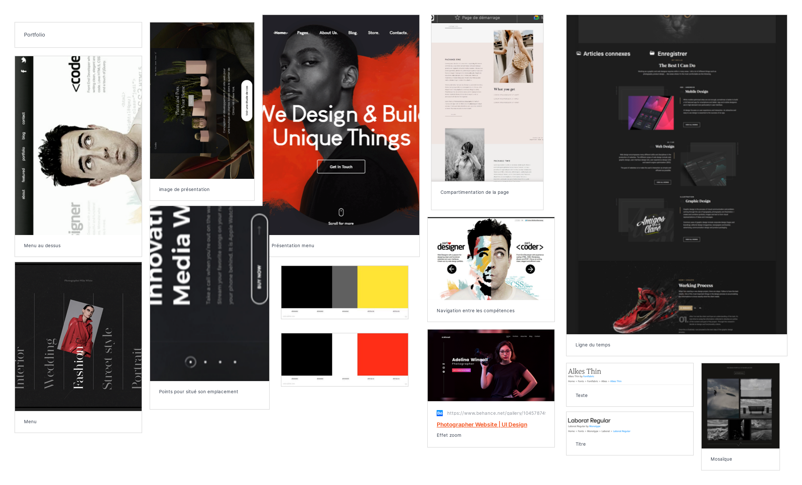

# Projet Portfolio

Ce repo à été créé pour un exercice de la HEPL
(https://github.com/hepl-dw/projet-portfolio)

***

## [Moodboard](https://app.milanote.com/1Ld0eE1zxVkL5x?p=EPVRAK7yDeh)

<a href="https://app.milanote.com/1Ld0eE1zxVkL5x?p=EPVRAK7yDeh">Liens du moodboard</a>