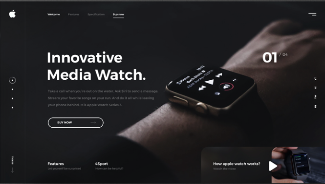
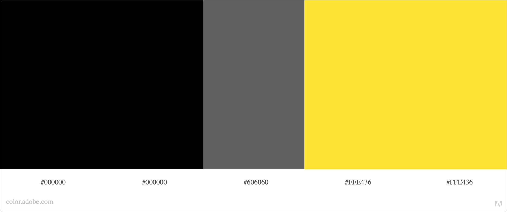
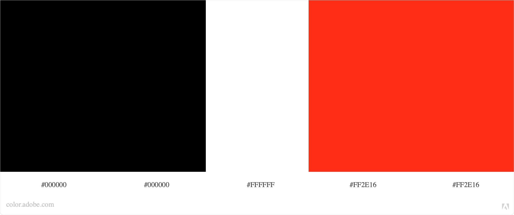

# Projet Portfolio

Ce repo à été créé pour un exercice de la HEPL
(https://github.com/hepl-dw/projet-portfolio)

***

## Stratégie

* Objectif

Dans le milieu de la création web, un portfolio est indispensable pour montrer le travail accomplis, ses compténces, ... Il est aussi important pour démontrer, au client, futurs patrons, son style ainsi que ses goûts. Cet outil fait office de curriculum vittae. 

* Page de chargement

Cette page contiendra mon logo, qui se dessinera progressivement en même temps qu'une barre de chargement.

* Page d'accueil

Sur cette page, sur le coté gauche il y aura une "barre de progression" composée d'une ligne et des points qui représenterons l'avancement sur la page.

Dans l'en-tête il y aura un menu avec les différentes pages du site. Ainsi que mon logo, mon nom, ...

Dans la première section de cette page (présentation),
il y aura une photo avec comme titre mon nom, prénom. a droite de cette photo il y aura un texte de présentation.

La deuxième section de cette page sera une sorte de ligne du temps, qui présentera toutes mes 5 dernières réalisations de la plus anciennes a la plus récente qui sera en premiers. Les réalisations se disposeront de manière verticale, de part et d'autre d'un ligne finement tracée. Chaques réal. comportera d'un titre, petit texte explicatif ainsi que d'une prévisualisation du projet. On pourra cliquer sur ce dernier pour ce rendre à la page dédiées du projet/réalisation.

A la fin de cette page, la dernière section (me contacter) servira de redirections vers mes réseaux sociaux, et de mon mail professionnel.

Il y aura un bouton de redirection vers la page "Me contacter". Il y aura aussi des liens vers mes réseaux sociaux sous forme de leurs icones respectifs.

* Contact

Cette page servira uniquement a pouvoir me contacter directement (avec un mail par exemple):

A gauche de cette page, il y aura un texte explicatif de comment le contact va se réaliser avec une illustration?

A droite de cette page, il y aura le formulaire de contact qui contiendra, une zone pour entrer le nom et prénom de la personne,  l'e-mail de la personne, une zone pour mettre le sujet du message, une zone pour le message, et enfin un bouton pour envoyer les messages.

***

## [Moodboard](https://app.milanote.com/1Ld0eE1zxVkL5x?p=EPVRAK7yDeh)

## Mood général

## Menu

[Séparation des sous-catégories](https://www.behance.net/gallery/111465583/Photographer-Mike-White?tracking_source=search_projects_recommended%7Cportfolio%20website)

[Menu au dessus de la page, barré la section actuel](https://www.behance.net/gallery/106729969/Clean-Portfolio-Website-Design?tracking_source=search_projects_recommended%7Cportfolio%20website)

[Compartimentation de la page](https://pin.it/7h8OBzz)

[Aller de comptétences en compétences](https://pin.it/4xJNvkV)

[Les parties sont représentées par des points qui sont encerclé quand on est la partie](https://dribbble.com/shots/4730541)

[Pour une ligne du temps ou un historique ou un ordre chronologique](https://www.behance.net/gallery/43818043/Personal-website)

## Couleurs

Palette de 2,3 couleurs

[Jeu entre noir et gris, peut-être ajouter du rouge pour les éléments important](https://www.behance.net/gallery/108115427/Website-Portfolio-Design-UXUI?tracking_source=search_projects_recommended%7Cportfolio%20website)

[Jeu entre noir jaune et blanc](https://www.behance.net/gallery/105674481/Portfolio?tracking_source=search_projects_recommended%7Cportfolio%20website)

## Animation

[Effet zoom](https://www.behance.net/gallery/104578749/Photographer-Website-UI-Design?tracking_source=search_projects_recommended%7Cphotography%20website%20web%20design)

## Divers

### Polices

#### Gros titre

[Mon nom, "Titre de la page"](https://www.myfonts.com/fonts/jen-wagner/palmer-lake/)

#### Titre

[Titre, sous titre](https://www.myfonts.com/fonts/mti/laborat/regular/)

#### Texte

[Texte](https://www.myfonts.com/fonts/font-fabric/alkes/thin/)

### Disposition

[Mosaïque](https://pin.it/7sWFrc7)

[Superposition](https://dribbble.com/shots/12049190-Real-Estate-Website-Design)

## Wireframe

### Accueil

### Contact

### Mes réalisations

